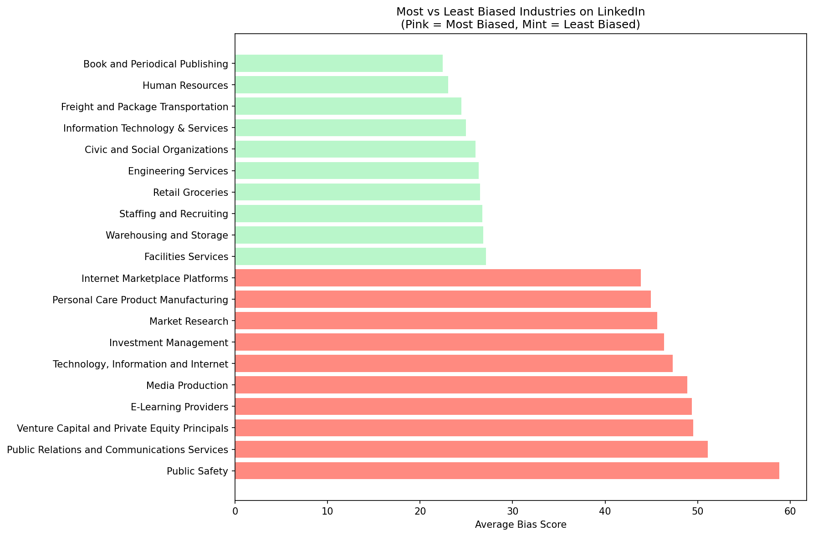
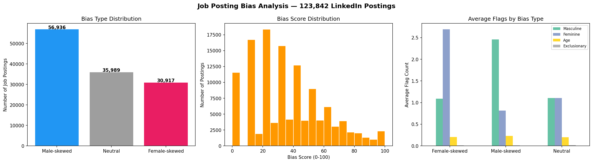

# 🔍 Job Posting Bias Analyser

A data-driven NLP tool that analyses job postings for gender-coded, age-biased, and exclusionary language — applied to 123,842 real LinkedIn job postings.

---

## 📌 Project Overview

Research shows that biased language in job postings significantly affects who applies. Masculine-coded words discourage women; age-biased language excludes older or younger candidates; exclusionary culture signals deter minority applicants — often without the employer realising it.

This project builds an automated bias detection pipeline using an evidence-based lexicon (Gaucher, Friesen & Kay, 2011), applied at scale to real LinkedIn data, producing actionable bias scores and visualisations.

---

## 🗂️ Dataset

- **Source:** [LinkedIn Job Postings 2023–2024 — Kaggle](https://www.kaggle.com/datasets/arshkon/linkedin-job-postings)
- **Size:** 123,842 job postings
- **Fields used:** Job title, company name, location, full description text, industry

---

## 🧠 Methodology

The analyser detects four categories of biased language:

| Category | Example Words | Weight |
|---|---|---|
| Masculine-coded | rockstar, ninja, dominant, aggressive, hustle | 2x |
| Feminine-coded | collaborative, nurturing, empathetic, supportive | 2x |
| Age-biased | digital native, recent graduate, youthful | 3x |
| Exclusionary | beer fridays, fraternity, native english only | 3x |

Age and exclusionary language are weighted higher as they signal direct discrimination rather than subtle framing effects.

**Bias Score (0–100):** weighted sum of flags, capped at 100.
**Bias Type:** Male-skewed / Female-skewed / Neutral based on relative flag counts.

---

## 📊 Key Findings

### Bias Type Distribution (123,842 postings)
| Bias Type | Count | Percentage |
|---|---|---|
| Male-skewed | 56,936 | 46% |
| Neutral | 35,989 | 29% |
| Female-skewed | 30,917 | 25% |

Nearly half of all LinkedIn job postings lean masculine — bias is widespread and subtle, not extreme and rare.

### Most vs Least Biased Industries


**Most biased:** Public Safety (58.8), PR & Communications (51.1), Venture Capital (49.5), Tech & Internet (47.3)

**Least biased:** Human Resources (23.0), Book Publishing (22.4), Freight & Transport (24.5)

The industries most vocal about diversity often have the most biased hiring language — a measurable gap between intent and practice.



---

## 🛠️ Bias Report — Live Demo

Paste any job description and get an instant bias report:

```
============================================================
BIAS ANALYSIS REPORT: Software Engineer (Biased Example)
============================================================
Bias Score:  100/100
Bias Type:   Male-skewed
Total Flags: 12
------------------------------------------------------------
⚡ Masculine-coded words: competitive, aggressive, ninja, rockstar, hustle, dominate, driven
⏰ Age-biased language:   digital native, recent graduate
🚫 Exclusionary language: beer fridays, frat, fraternity
------------------------------------------------------------
🔴 High bias — significant revision recommended.
============================================================
```

---

## 🚀 How to Run

1. Open the notebook on Kaggle: *(add your Kaggle notebook link here)*
2. Attach the [LinkedIn Job Postings dataset](https://www.kaggle.com/datasets/arshkon/linkedin-job-postings)
3. Run all cells in order

No local setup required — runs entirely in Kaggle cloud environment.

---

## 🛠️ Tech Stack

- Python 3.12
- Pandas & NumPy
- Matplotlib
- Evidence-based NLP lexicon (Gaucher et al., 2011)

---

## 💡 Key Concepts Demonstrated

- Large-scale text analysis (123K+ documents)
- Evidence-based NLP lexicon design
- Bias detection and quantification
- Data visualisation and insight communication
- Ethical AI — fairness in automated systems

---

## 📚 Research Foundation

Gaucher, D., Friesen, J., & Kay, A. C. (2011). Evidence that gendered wording in job advertisements exists and sustains gender inequality. *Journal of Personality and Social Psychology*, 101(1), 109–128.

---

## 🔮 Future Work

- Fine-tune a transformer model (BERT) for contextual bias detection
- Build an interactive web app for real-time job posting analysis
- Extend lexicon with industry-specific bias patterns
- Add sentiment analysis layer for tone detection

---

## 👩‍💻 Author

**Shweta Sarkar**
MSc Business Analytics & International Business | University of Dundee
[LinkedIn](https://linkedin.com/in/shwetapooja) • [GitHub](https://github.com/Shweta-Portfolio)
